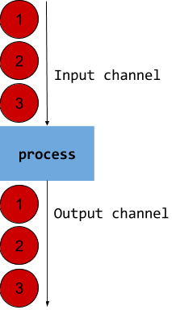
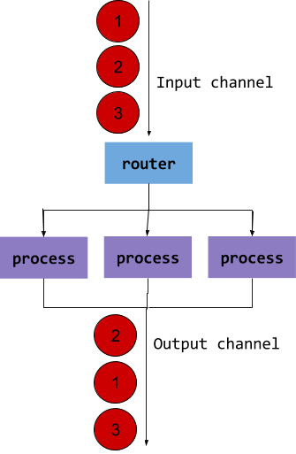
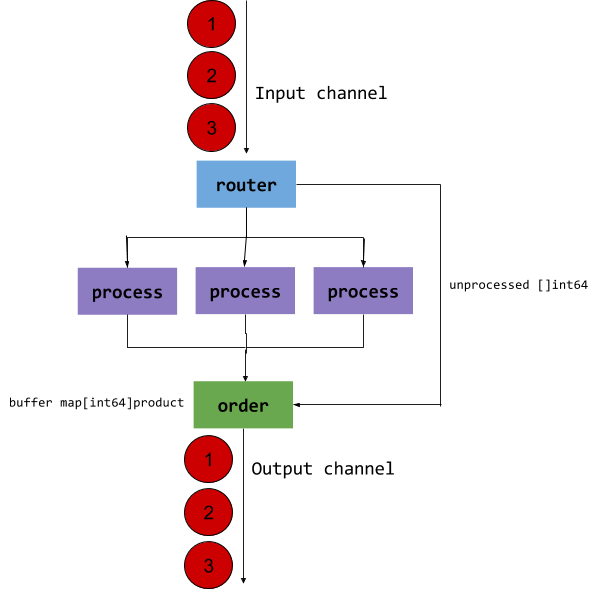

# ParSeq 
[](https://travis-ci.org/MarianoGappa/parseq) 
[](https://godoc.org/github.com/MarianoGappa/parseq) 
[](https://raw.githubusercontent.com/MarianoGappa/parseq/master/LICENSE)


The parseq package provides a simple interface for processing a stream in parallel,
with configurable level of parallelism, while still outputting a sequential stream
that respects the order of input.

## WAT?

In 99% of the cases, you read messages from a channel and process them sequentially. This is fine. Note that if the channel is unbuffered, your goroutine blocks the next message for the length of the time it takes to process each message. If processing is a lengthy operation, it doesn't matter if the channel is buffered or not, except for the initial period.

```
for msg := range channel {
	process(msg)
}
```



If this throttling is problematic, you need to parallelise. When you parallelise, results can come out of order. This can be a problem (or not):

```
outputChannel := make(chan product)
workers := make(chan request, 3)

for i := 1; i <= 3; i++ {
	go newWorker(workers, outputChannel)
}

for msg := range inputChannel {
	workers <- msg
}
```



ParSeq goes just a little further from that model: it saves the order on the input side and holds a buffer on the output side to preserver order:



## Should I use this?

Probably not! Don't be clever. Only use it if:

1. the rate of input is higher than the rate of output on the system (i.e. it queues up)
2. the processing of input can be parallelised, and overall throughput increases by doing so
3. the order of output of the system needs to respect order of input

## Usage

```
package main

import (
	"fmt"
	"time"

	"github.com/marianogappa/parseq"
)

func main() {
	p := parseq.New(5, process)			// 5 goroutines using the process function

	go p.Start()
	go makeRequests(p)

	for out := range p.Output {			// after initial 1s, requests output every ~200ms
		fmt.Print(out.(int), ".")		// and output respects input order
	}
}

func makeRequests(p parseq.ParSeq) {
	counter := 666
	for {
		p.Input <- counter			// this simulates an incoming request
		time.Sleep(200 * time.Millisecond)	// requests come every 200ms
		counter++
	}
}

func process(value interface{}) interface{} {
	time.Sleep(1 * time.Second)			// processing a request takes 1s
	return value
}
```
